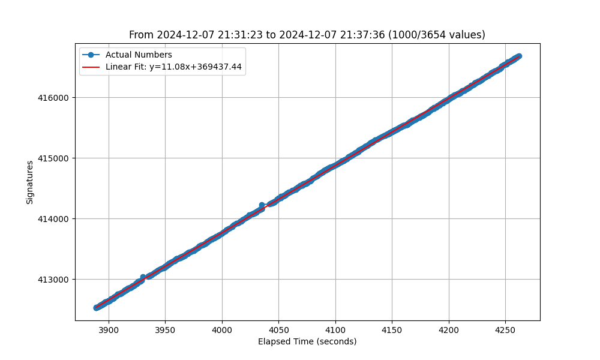

### AUR a creat o petitie cu informatii fake

Site-ul [Alegerilibere](https://alegerilibere.ro/index.html) pretinde ca afiseaza numarul de semnaturi stranse.

Acest script .sh face un request periodic pentru a prelua numarul de semnaturi din API-ul site-ului.

Datele existente incep de la 2024-12-07 20:26:34

Script-ul python face regresie liniara si compara rezultatele colectate cu o linie dreapta.

Se observă că datele legate de numărul de semnături sunt, de fapt, incrementate periodic și exact, și deci nu corespund cu un număr adevărat de semnături strânse

## HOW TO USE

### Requirements

- Python 3.x
- Pandas, Matplotlib, Scipy

```
pip install pandas matplotlib scipy
```

### Rulare

```
python3 test.py [fisier] [nr_esantioane] [offset_esantioane]
```

#### Argumente

1. [fisier] - by default, fisierul testat va fi output.csv, dar acesta contine multe date preluate la intervale diferite de timp. Recomand rularea cu fisierele batch_1.csv (20:26 - 23:54), batch_2.csv (00:37 - 01:03) sau batch_3.csv (09:59 - 10:13).
2. [nr_esantioane] - by default, None, deci se folosesc toate datele din fisier. Se poate folosi o valoare cum ar fi 500 pentru a se observa cresterea clar liniara pe intervale mai scurte de timp
3. [offset_esantioane] - by default, None, deci se incepe de la 0. Se poate folosi in combinatie cu nr_esantioane pentru a studia cresterea pe diferite intervale de timp a nr. de semanturi

### Exemple rulare

`python3 test.py batch_1.csv 500`


`python3 test.py batch_2.csv 500`


`python3 test.py batch_3.csv`


`python3 test.py batch_3.csv`


`python3 test.py batch_1.csv 1000 1000`



## UPDATE

Server-ul da raspuns foarte foarte incet, pot colecta date doar la ~10 secunde. Reparat script-ul pentru a avea in vedere diferentele de timp. E o linie dreapta 100% din nou.

## UPDATE

Site-ul a fost inchis o perioada incepand cu ora 01:00 08.12.2024, si redeschis dimineata. Colectarea datelor a reinceput la ora 09:59
